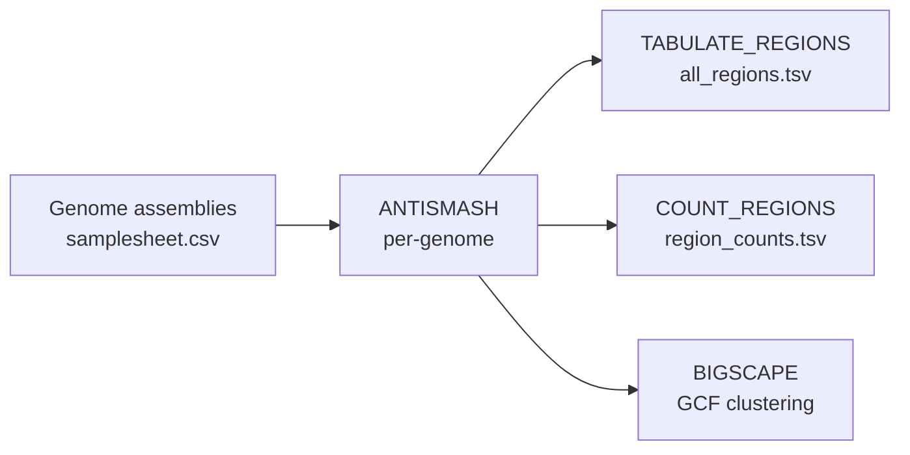

# clystere

**clystere** is a Nextflow pipeline for automated biosynthetic gene cluster (BGC) discovery and comparative analysis. It
orchestrates [antiSMASH](https://antismash.secondarymetabolites.org/) across a collection of bacterial or fungal
genomes, optionally groups the resulting BGCs into gene cluster families (GCFs) with
[BiG-SCAPE](https://github.com/medema-group/BiG-SCAPE), and produces ready-to-use summary tables for downstream
analysis.

---

## Overview



---

## Features

- Parallel antiSMASH annotation across any number of genome assemblies or GenBank files
- Per-region tabulation and per-genome BGC count summary
- Optional BiG-SCAPE clustering

---

## Quick start

```bash
nextflow run exterex/clystere \
    --input samplesheet.csv \
    --outdir results \
    -profile docker
```

See [Installation](installation.md) and [Usage](usage.md) for full details.
