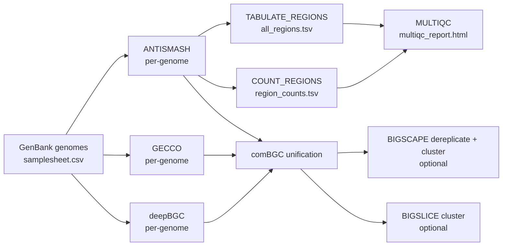

# clystere

**clystere** is a Nextflow pipeline for automated biosynthetic gene cluster (BGC) discovery and comparative analysis. It
runs [antiSMASH](https://antismash.secondarymetabolites.org/), [GECCO](https://github.com/zellerlab/GECCO), and
[deepBGC](https://github.com/Merck/deepbgc) across a collection of bacterial or fungal genomes, merges overlapping
predictions with [comBGC](https://github.com/tomrichtermeier/comBGC-Filter), and optionally groups representative BGCs
into gene cluster families (GCFs) with [BiG-SCAPE](https://github.com/medema-group/BiG-SCAPE) or
[BiG-SLiCE](https://github.com/medema-group/bigslice).

---

## Overview



---

## Features

- Parallel antiSMASH + GECCO + deepBGC annotation across any number of GenBank genome files
- comBGC-based unification of overlapping predictions before clustering
- Per-region tabulation and per-genome BGC count summary
- MultiQC HTML report aggregating software versions and BGC metrics
- Optional BiG-SCAPE or BiG-SLiCE clustering (mutually exclusive)
- Optional BiG-SCAPE dereplication of redundant regions before clustering

---

## Quick start

```bash
nextflow run andreassag/clystere \
    --input assets/samplesheet.csv \
    --outdir results \
    -profile docker
```

See [Installation](installation.md) and [Usage](usage.md) for full details.
